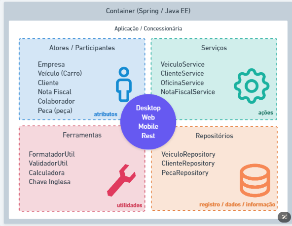

## Tipos de classes

Classe de modelo (model): classes que representam estrutura de domínio da aplicação, exemplo: Cliente, Pedido, Nota Fiscal e etc.

Classe de serviço (service): classes que contém regras de negócio e validação de nosso sistema.

Classe de repositório (repository): classes que contém uma integração com banco de dados.

Classe de controle (controller): classes que possuem a finalidade de disponibilizar alguma comunicação externa, à nossa aplicação, como http web ou webservices.

Classe utilitária (util): classe que contém recursos comuns, à toda nossa aplicação.

## Pacotes

Comercial : com.powersoft;

Governamental : gov.powersoft;

Código aberto: org.powersoft.